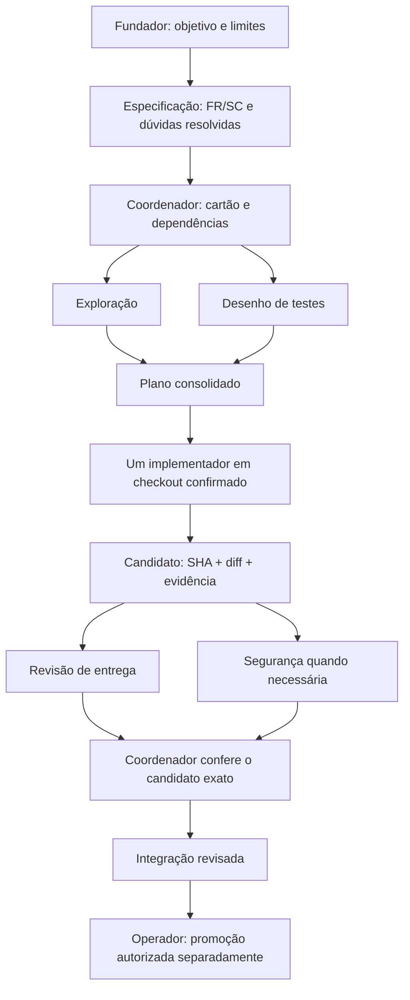

# 01 · Equipe, topologia e responsabilidade

Data: 2026-09-14. Decisão inicial: coordenação central, especialistas temporários,
um escritor e integração serial. A necessidade é entregar o MVP com previsibilidade;
não criar departamentos ou manter agentes ocupados sem resultado verificável.

## Quem responde por quê

| Função | Responsabilidade exclusiva | Entrega | Quando entra |
|---|---|---|---|
| Fundador / dono do produto | Prioridade, promessa ao cliente e aceitação de risco residual | objetivo e decisões comerciais | início, conflito de produto e liberação operacional |
| Coordenador (sessão principal) | Decompor, reservar capacidade, consolidar, conferir evidência e integrar | plano, diário e resultado consolidado | toda rodada |
| Explorador | Mapear fluxo e restrições sem mudar contratos | mapa e incertezas | código desconhecido ou mudança transversal |
| Implementador | Construir uma fatia dentro do cartão | candidato testado e handoff | após preparação |
| Especialista em testes | Definir oráculo e cenários de falha independentemente do código | matriz de aceite | antes da escrita e ao conferir resultado |
| Revisor de segurança | Examinar fronteiras de confiança e recuperação | achados reproduzíveis | auth, tenant, dados, integração, CI, política |
| Revisor de entrega | Examinar correção, compatibilidade e aderência | parecer sobre SHA | todo candidato de código |
| Operador de release | Promover, pausar e recuperar ambiente autorizado | registro de operação externa | fora da autonomia inicial |

Cada missão é declarada em `team/roles.json` com cinco fronteiras explícitas — **quando
entra**, **o que entrega**, **quando está concluída**, **quando para e devolve** e **o que é
proibido** — e aponta um procedimento em `procedures/`. O especialista carrega o procedimento
da sua missão e o cartão; não a documentação inteira. Os perfis em `.codex/agents` são
gerados do catálogo (`scripts/render-profiles.mjs`) e um teste falha se divergirem: duas
descrições da mesma missão sempre divergem, e a que o agente carrega é a que ninguém revisou.

Os cinco especialistas têm perfis. Fundador e operador são responsabilidades humanas;
coordenador usa a sessão principal. Não existe perfil de agente com chave de produção.
Segurança e revisão de entrega podem ocorrer em paralelo em diretórios de leitura.
Um reparo volta ao implementador e invalida as revisões do candidato anterior.

Para uma correção simples: coordenador → implementador → revisor. Para RLS:
explorador + especialista de testes → implementador → segurança + revisão de entrega.
Não invocar todos por hábito. Especialistas não se autodelegam e não negociam escopo
entre si sem decisão registrada pelo coordenador.

## Topologia

O plano é um DAG de dependências. Duas leituras independentes cabem na mesma rodada.
Dependência de código se libera após integração e atualização da base, nunca só por
mensagem “terminei”. Slots medem especialistas ativos; o coordenador fica fora dos três.
A v0.1 reserva no máximo um escritor global, mesmo quando diretórios não se cruzam.

## Método e previsibilidade

Kanban com limites de trabalho em andamento: especificar → preparar → pronto → executar →
revisar → integrar. Entrega vertical pequena, branch curta e teste do comportamento.
Sprint é opcional; não usar calendário como prova de prontidão. Duração do cartão é
um limite de execução, não promessa de prazo comercial.

Definição de especificado: requisitos numerados, critério de sucesso com grandeza, evidência
capaz de refutar cada requisito e nenhuma dúvida em aberto. Enquanto houver dúvida, o plano
não é válido — a decisão volta a quem tem autoridade sobre o contrato, e não é suprida por
suposição do implementador. Definição de preparado: objetivo observável, requisitos cobertos,
dono de contrato, entradas disponíveis, dependências integradas, ambiente permitido, escopo,
aceite, orçamento e revisor.
Definição de candidato: diff delimitado, testes concluídos no SHA e pendências explícitas.
Definição de integrado: destino contém o candidato ou resultado reconciliado novamente
testado e revisado. Definição de implantado: evidência do provedor e verificação do ambiente.

Conflito técnico: apresentar contraexemplo e duas alternativas, consultar documento dono,
registrar ADR se mudar contrato. O coordenador resolve decisões reversíveis no escopo.
Produto, exposição financeira, autoridade e dados operacionais voltam ao dono responsável.

## Autonomia por capacidade

| Nível | Capacidade | Situação inicial |
|---|---|---|
| A0 | Ler, analisar, propor | Permitido em tarefa autorizada |
| A1 | Editar e testar em checkout delimitado | Supervisionado, um escritor |
| A2 | Publicar branch/PR no repositório autorizado | Coordenador, quando autorizado; sem merge implícito |
| A3 | Implantar DEV/HOM | Futuro, após identidade e portões do ambiente |
| A4 | Produção, segredos, loja, restauração real | Operador autorizado; nunca consequência automática de A1 |

A numeração é local, não padrão externo. Capacidade efetiva é a interseção entre a
autorização do usuário, política confiável, ferramenta disponível e ambiente.
Um cartão ou prompt não amplia a permissão do host. Revisores com nomes diferentes
não constituem identidades de segurança independentes.

